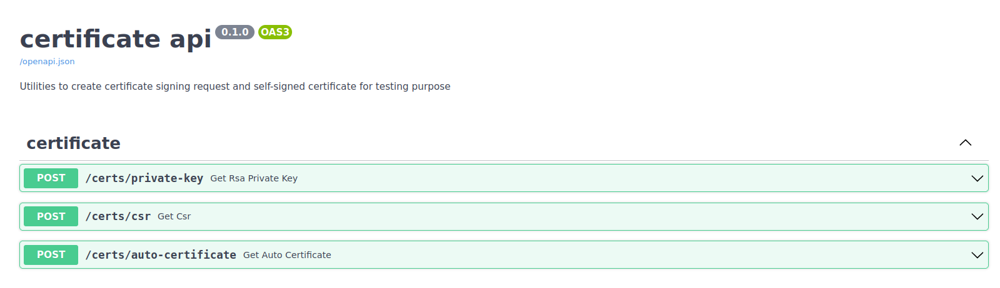

# certipie

[](https://pypi.org/project/certipie/)
[](https://github.com/lewoudar/certipie/actions/)
[](https://codecov.io/gh/lewoudar/certipie)
[](https://github.com/lewoudar/certipie)
[](http://www.apache.org/licenses/LICENSE-2.0)
[](https://github.com/lewoudar/certipie)

A utility library to create certificate signing request and self-signed certificates.

## Why?

There are three main reasons why I decide to do this:

- I am a *nerd* who loves to code. Yeah, I need to be honest here, it was an opportunity for me to play with the
  excellent [cryptography](https://cryptography.io/en/latest/) library.
- I currently work in a company where we deal a lot with certificates, and I know it can be handy to have a simple tool
  to generate certificate signing request, so I decide to create one.
- When creating or working with network servers, we often need to test certificate handling, so it is convenient to have
  a tool to quickly generate a self-signed certificate.

Notes:

- If you want a tool to handle a whole certificate life cycle for your project, consider using a library like
  [certbot](https://eff-certbot.readthedocs.io/en/stable/).
- If you just want a tool to create certificates on the fly during unit tests, consider using
  [trustme](https://trustme.readthedocs.io/en/latest/).

## Installation

The minimal python version supported is **3.9**. You can install the library using **pip** with the following command:

```shell
$ pip install certipie
```

You can also use an alternative package manager like [poetry](https://python-poetry.org/docs/):

```shell
$ poetry add certipie
```

## Usage

There are three ways to use certipie.

### The command line interface

This is probably the main way to use it. The project includes a convenient `cert` command line interface.

```shell
$ cert
Usage: cert [OPTIONS] COMMAND [ARGS]...

  A cli to generate certificate signing request and self-signed certificate
  that can be used for testing purpose.

Options:
  --version   Show the version and exit.
  -h, --help  Show this message and exit.

Commands:
  auto-cert           Creates a self-signed certificate useful for tests.
  csr                 Creates a certificate signing request file given...
  install-completion  Install completion script for bash, zsh and fish...
  rsa                 Creates a pair of private/public keys using the RSA...
  server              Serves a swagger UI where you can perform the same...
```

#### install-completion

The first command you will want to use is `install-completion` like the name said will allow options and commands
completion. The shells currently supported are **bash**, **fish** and **zsh**.

```shell
$ cert install-completion
```

#### rsa

To create a certificate signing request or a self-signed certificate, you need a private key. The `cert` command allows
you to create an **RSA** private key which is one of the most common (if not the most common) private keys used for this
type of operation.

```shell
$ cert rsa
Enter the passphrase [passphrase]:
Repeat for confirmation:
The pair of keys was successfully in ...
```

Note: On all commands, you can use `-h` option to get their usage documentation.

#### csr

This commands helps you create a certificate signing request.

```shell
$ cert csr -f csr.pem
Organization: orga
State: Ile-de-France
Country: FR
City: Paris
Name: site.com
The certificate signing request has been successfully created in /home/kevin/...
```

Notes:

- In the previous example since no private key was passed as input, the `csr` command creates an **RSA** one with no
  password in the same directory where the certificate signing request is created. If you want to provide one, use the
  `-k` option and gives the path to the private key, e.g: `cert csr -k /path/to/private/key`. It is not mandatory that
  the private key is of type RSA. In fact other algorithms are supported like DSA or elliptic curve. For a full list of
  supported algorithms, look `PrivateKey` type in module `certipie.types`.
- If you pass a key file, you will be prompted to give the password. If you don't provide a password to your private
  key, just type `Enter` to continue.
- The `--country` option must be a two-letters value. To know the two-letters code of a country, you can check this
  [website](https://www.iban.com/country-codes).
- The `--name` option value is used as the domain name to submit for the certificate signing request. In the previous
  example, it will be `site.com`. Wildcards like `*.site.com` are supported.
- If you want to include many domain names in the certificate signing request, not only the `--name` value, you can use
  the `--alt-names` option like the following: `cert csr --alt-names=site.com,foo.site.com`. The values **must**
  be separated by commas.

#### auto-cert

This command helps you create a self-signed certificate useful when you want to test a network server like an HTTP
server.

```shell
$ cert auto-cert -f cert.pem --validity=360
Organization: orga
State: Ile-de-France
Country: FR
City: Paris
The self-signed certificate has been successfully created in /home/kevin/...
```

Notes:

- The notes from the `csr` command also applies here.
- Since we often work on our own computer in this case, `localhost` is the default `--name` option.
- `--alt-names` also accepts ip adresses and networks. You can have a value like the following:
  `cert auto-cert --alt-names=localhost,192.168.1.0/24`.
- `--validity` option represents the number of days the certificate will be valid. If not provided, it is **365**.

#### server

This commands runs a server which serves a Swagger UI where you can perform the previous commands explained above. This
is handy if you want non-technical staff to be able to use the command line features.

```shell
$ cert server
```

If you open a browser on http://localhost:8000 you will see the swagger documentation.


Under the hood the server used is [hypercorn](https://pgjones.gitlab.io/hypercorn). You can configure it passing a
*toml* configuration file. To know all the settings available, refer to the
[official documentation](https://pgjones.gitlab.io/hypercorn/how_to_guides/configuring.html).

```shell
$ cert server -c /path/to/toml/file
```

### The REST API

Following the previous section about serving a swagger UI, if you think that it does not well suits your organization,
you can adjust it. The api is created using the [FastAPI](https://fastapi.tiangolo.com/) web framework. For example if
you want to integrate it in your own fastapi application, you can use the router provided by certipie.

This way you can adjust the url used for the certificate routes, for example `/certificate` instead of `/certs`, change
documentation url, add some authentication to routes, etc...
The [router](https://fastapi.tiangolo.com/tutorial/bigger-applications/) concept is a powerful feature from FastAPI.

```python
from fastapi import FastAPI
from certipie import router

app = FastAPI(
    title='certificate api',
    description='Your description',
    redoc_url=None,
    docs_url='/documentation'
)
app.include_router(router, prefix='/certificate', tags=['certificate'])
```

Transform the api to suit your needs :)

### The certipie API

The last way to leverage certipie is to interact programmatically with its api. The following functions are exposed:

- `create_private_key`: Creates an RSA private key.
- `get_public_key_from_private_key`: Extracts a public key from a private key.
- `create_csr`: Creates a certificate signing request.
- `create_auto_cert`: Creates a self-signed certificate.

Normally the api usage should be straightforward. The behaviour is the same as the command line. You can also look at
tests if you are blocked.

Here is a snippet on how to create a certificate signing request using `create_csr`:

```python
from certipie import create_csr

create_csr(
    'csr.pem',
    'FR',
    'Ile-de-France',
    'Paris',
    'organization',
    'site.com',
    alternative_names=['site.com', 'foo.site.com'],
    private_key='key.pem',
    passphrase='passphrase'
)
```

There are two others objets exported:

- `app`: The fastapi application used when running `cert server` command. It is exposed so that you can
  [mount](https://fastapi.tiangolo.com/advanced/sub-applications/) it in another application if you want.
- `PrivateKey`: The type annotation for all the private keys supported by the `cryptography` library.
